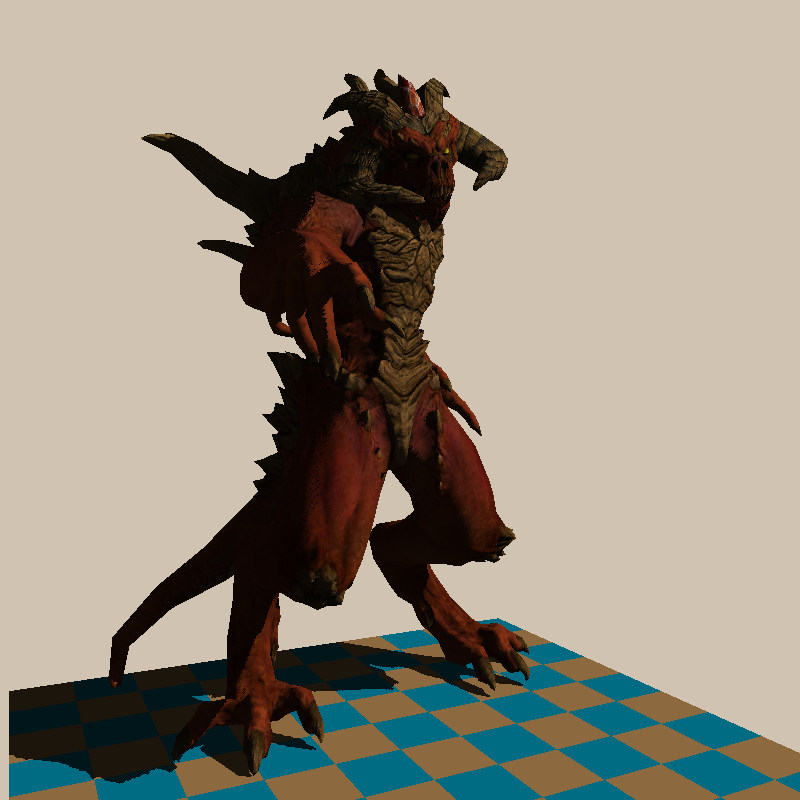
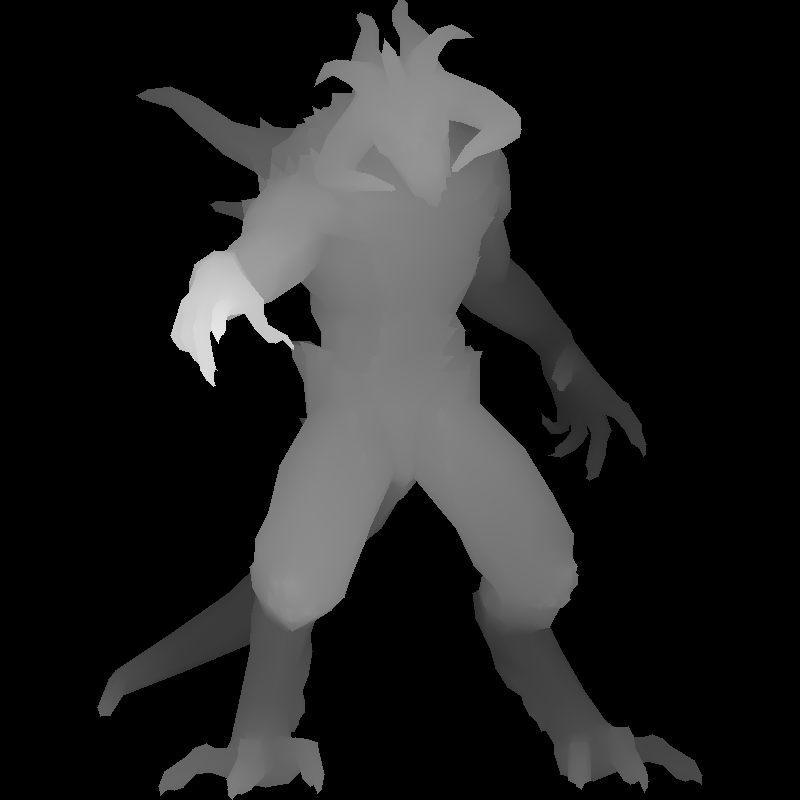

# Tinyrenderer

A simple software renderer written from scratch in C++ with no external graphics libraries

## Features

- **Phong Shading** - Full ambient + diffuse + specular lighting model
- **Shadow Mapping** - Two-pass rendering with depth-based shadow detection and bias correction
- **Screen-Space Ambient Occlusion (SSAO)** - 128-sample hemisphere kernel with smoothstep falloff
- **Normal Mapping** - Tangent-space normal maps for surface detail
- **Texture Mapping** - Diffuse, specular, and normal map support
- **Perspective-Correct Interpolation** - Proper attribute interpolation with w-coordinate correction
- **Z-Buffering** - Per-pixel depth testing
- **Backface Culling** - Signed area test for triangle rejection
- **OBJ Model Loading** - Supports vertices, UVs, normals, and faces (very primitive, assumes [-1, 1] vertex range)

## Compilation

```bash
mkdir build && cd build
cmake ..
make
```

Requires CMake 3.12+ and a C++20 compatible compiler.

## Usage
(from the root directory)
```bash
./build/tinyrenderer <model.obj> [model2.obj ...]
```

Pass one or more `.obj` files as arguments. 

### Example

```bash
./build/tinyrenderer obj/diablo3_pose/diablo3_pose.obj obj/floor.obj
```

## Output

The rendered image is saved to `framebuffer.tga`.

## Examples made with the renderer




